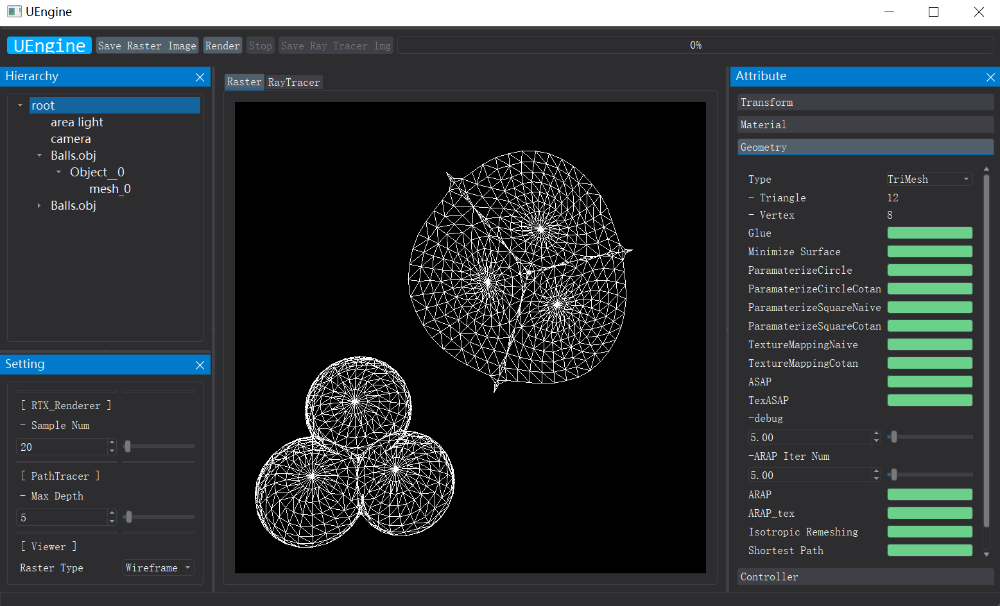

# ASAP & ARAP Parameterization

**The codes of rendering engine are from teaching assistant Ubpa, including graphics mathematical calculation lib UGM, Half edge structure lib UHEMesh and other basic libs.**

Requirements
+ Qt5
+ assimp (for loading obj)

Build Method 
+ use cmake: config, generate, then build. 

Editor interface:

For core codes, please see: 
1. ASAP 
    [header](https://github.com/Ricahrd-Li/ASAP_ARAP_Parameterization/blob/master/include/Engine/MeshEdit/ASAP.h)
    [cpp](https://github.com/Ricahrd-Li/ASAP_ARAP_Parameterization/blob/master/src/Engine/MeshEdit/ASAP.cpp)
2. ARAP
    [header](https://github.com/Ricahrd-Li/ASAP_ARAP_Parameterization/blob/master/include/Engine/MeshEdit/ARAP.h)
    [cpp](https://github.com/Ricahrd-Li/ASAP_ARAP_Parameterization/blob/master/src/Engine/MeshEdit/ARAP.cpp)

The Structure of the whole project:

+ [``src/Engine``](https://github.com/Ricahrd-Li/ASAP_ARAP_Parameterization/tree/master/src/Engine): The core of render engine, which includes light, material, intersector, viewer, etc. 
    + [``src/Engine/MeshEdit``](https://github.com/Ricahrd-Li/ASAP_ARAP_Parameterization/tree/master/src/Engine/MeshEdit) Contains the mesh editing algorithm includes minimum surface, ASAP parameterization, ARAP parameterization, etc. 

+ [``src/Basic``](https://github.com/Ricahrd-Li/ASAP_ARAP_Parameterization/blob/master/src/Basic/) Codes for math, timer and other basic facilities. 

+ [`src/UI`](https://github.com/Ricahrd-Li/ASAP_ARAP_Parameterization/tree/master/src/UI) UI layout, widget, etc.

+ [`src/Qt`](https://github.com/Ricahrd-Li/ASAP_ARAP_Parameterization/tree/master/src/Qt) Qt support.

+ [`src/OpenGL`](https://github.com/Ricahrd-Li/ASAP_ARAP_Parameterization/tree/master/src/OpenGL) OpenGL support.

+ [`src/App/UEngine`](https://github.com/Ricahrd-Li/ASAP_ARAP_Parameterization/tree/master/src/App/UEngine) Connect things together. 